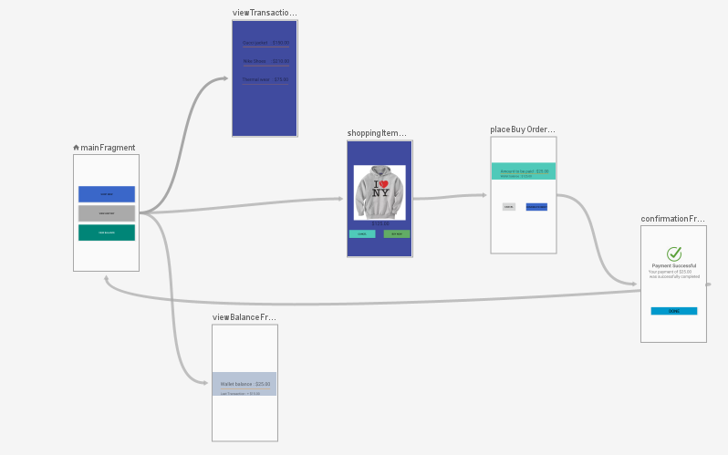

<h1>Android Navigation Components</h1>

An example to demonstrate the use of Android Navigation components for hassel free screen navigation from one fragment to another
  It prevents developers to write code for fragment transaction using FragmentManager/FragmentTransaction.

# Project Navigation Flow

    

 

<strong>Watch the very useful video on the same from Mitch Tabian:</strong> https://www.youtube.com/watch?v=IEO2X5OU3MY

